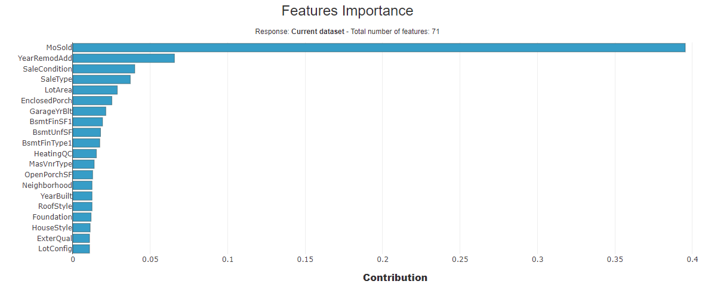
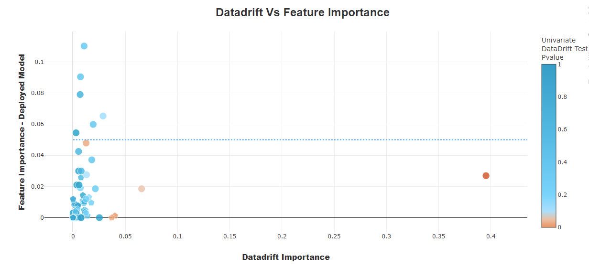
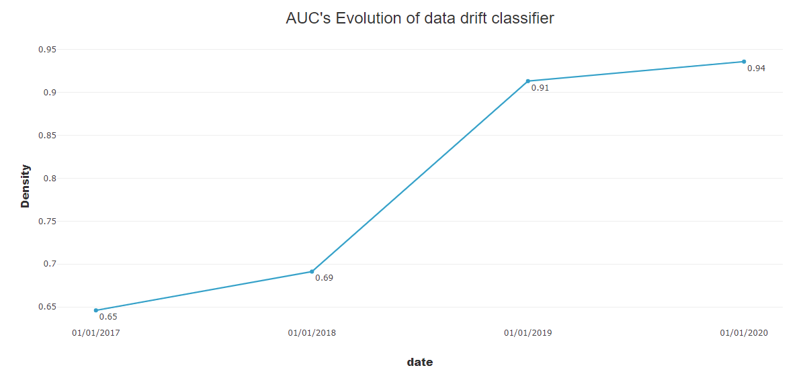
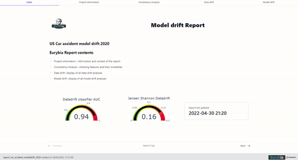

# Welcome to Eurybia's documentation!

{ width="300" }

**Eurybia** is a Python library dedicated to monitoring data science models. It provides visualizations in an HTML report, or directly in a notebook, to help detect data drift and model drift. It also supports data validation before putting a model into production.

## Eurybia's objectives

- Help data analysts, data engineers, and data scientists collaborate on data validation before deploying a model.

  { width="500" }

- Make data drift analysis easier and faster.

  { width="700" }

- Monitor drift over time.

  { width="600" }

- Display clear and understandable reports.

  { width="600" }

## Features

- Consistency analysis between baseline and current datasets
- Data drift classifier performance
- Feature importance and drift impact analysis
- Distribution comparisons for datasets and predicted values
- Feature contributions for the data drift classifier
- AUC and model performance evolution over time
- Configurable reports adapted to each use case

Eurybia provides a [`SmartDrift`](reference/smartdrift.md) class with a simple API and sensible defaults. Very few arguments are required, while additional metadata and data preparation make reports clearer for end users.

Eurybia is developed by [MAIF](https://www.maif.fr/) and available on [GitHub](https://github.com/MAIF/eurybia).

Eurybia is distributed under the Apache License 2.0.
