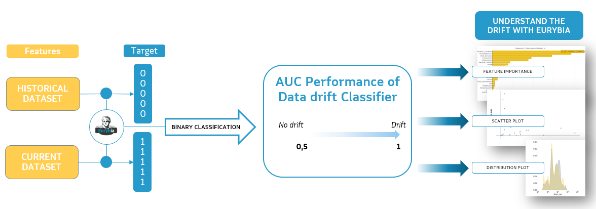

# Overview

## Installation

Install Eurybia from PyPI:

```bash
pip install eurybia
```

## How does Eurybia work?

Eurybia trains a binary classifier, called the data drift classifier, to predict whether a sample belongs to the baseline dataset or the current dataset.

{ width="700" }

The baseline samples receive a target value of `0`, while current samples receive `1`. The two datasets are concatenated and used to train the classifier. Its AUC (area under the ROC curve) measures how easily the datasets can be distinguished: an AUC close to `0.5` indicates little drift, while an AUC close to `1` indicates substantial drift.

The classifier's explainability results identify the features driving that difference and highlight those that matter most to the deployed model.

## Getting started in three steps

### 1. Create a SmartDrift object

Pass at least a current and a baseline pandas DataFrame:

```python
from eurybia import SmartDrift

sd = SmartDrift(
    df_current=df_current,
    df_baseline=df_baseline,
    deployed_model=my_model,  # Optional
    encoding=my_encoder,  # Optional
    dataset_names={
        "df_current": "Current dataset",
        "df_baseline": "Baseline dataset",
    },
)
```

### 2. Compile the drift analysis

```python
sd.compile(
    full_validation=True,
    date_compile_auc="01/01/2022",
    datadrift_file="datadrift_auc.csv",
)
```

All arguments shown above are optional. Keep `full_validation=False` (the default) for a faster analysis.

### 3. Generate the report

```python
sd.generate_report(
    output_file="output/my_report_name.html",
    title_story="My report",
    title_description="My report subtitle",
    project_info_file="project_info.yml",
)
```

Providing a deployed model and its encoder enriches the report when both datasets contain the model's expected features and data types.
