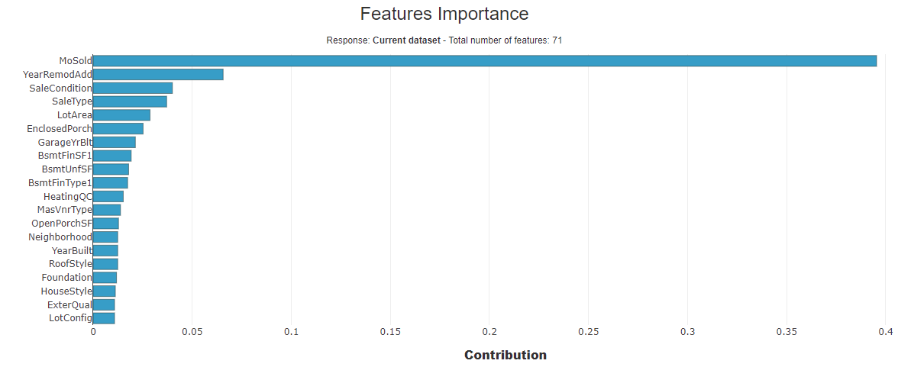
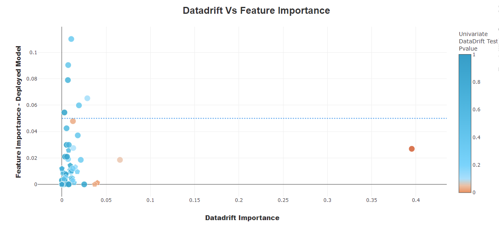
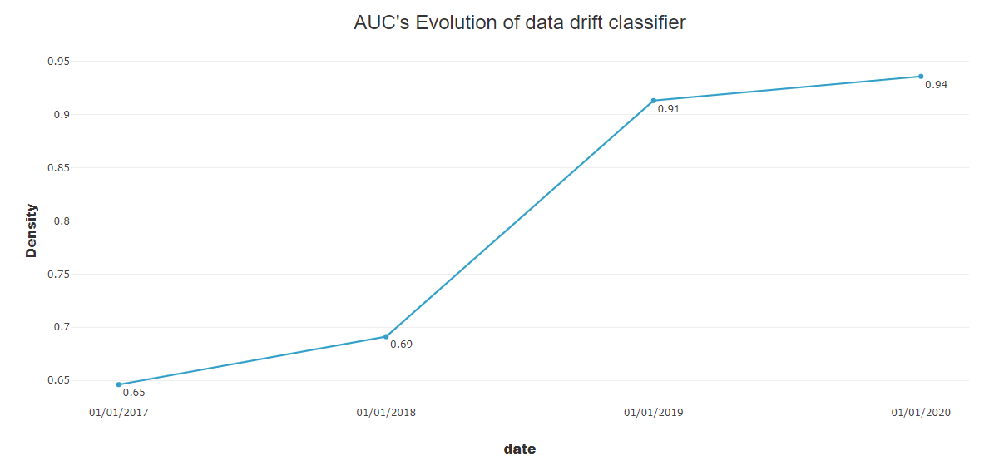
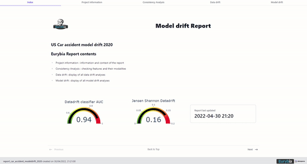

.. Eurybia documentation master file, created by
   sphinx-quickstart on Mon Apr  2 15:29:28 2018.
   You can adapt this file completely to your liking, but it should at least
   contain the root `toctree` directive.

Welcome to Eurybia's documentation !
=====================================

**Eurybia** is a Python library dedicated to the monitoring of Data Science models. It provides several types of visualizations that display through an HTML report (or directly in notebook mode) which help in detecting drift (data drift & model drift).
It also support data validation before putting a model into production.

+-----------------------------------+----------------------------------------------------------+-----------------------------------------+
| Company                           | GitHub Account                                           | Website                                 |
+===================================+==========================================================+=========================================+
| .. image:: ../_static/maif.png    | `MAIF GitHub <https://github.com/MAIF>`_                 | `MAIF <https://www.maif.fr/>`_          |
|   :align: center                  |                                                          |                                         |
|   :scale: 5%                      |                                                          |                                         |
+-----------------------------------+----------------------------------------------------------+-----------------------------------------+

**The objectives of Eurybia**
------------------------------

- Help data analysts, data engineers and data scientists to collaborate for data validation before deploying a model into a production environment

- Make it easier and faster for data scientists to analyze data drift

- Monitoring drift over time

- Display clear and understandable insightful report

**Eurybia** features
---------------------
- Consistency analysis between the baseline dataset and the current dataset
- Performance of the data drift classifier
- Feature importance: features that discriminate the most two datasets
- Scatter plot: Putting the drift of a variable into perspective with its importance in the deployed model
- Dataset analysis: distribution comparison between variable from the baseline dataset and the current dataset
- Predicted values analysis: distribution comparison between predicted probabilities from the baseline dataset and the current dataset
- Features contribution for the data drift classifier
- AUC evolution: performance comparison for the data drift classifier over time
- Offers several parameters in order to summarize drift in the most suitable way for your use case
- Model performance evolution: compare your model performances over time

**Eurybia** is easy to install and use:
It provides a SmartDrift class to understand data and model drift. Plus it 's summarized them with a simple syntax.

High adaptability:
Very few arguments are required to display results. But the more you work on cleaning and documenting the data, the clearer the results will be for the end user.

.. toctree::
   :maxdepth: 3

   overview
   installation-instructions/index
   tutorials
   autodocs/index

License is Apache Software License 2.0