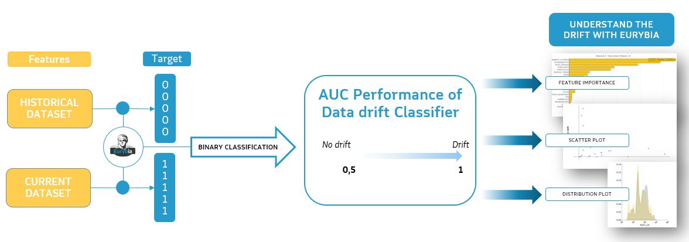

.. overview:

Overview
========

Installation
------------
You can install **Eurybia** using pip:

.. code:: ipython

    pip install eurybia

How does Eurybia work?
----------------------

**Eurybia** works mainly with a binary classification model (named datadrift classifier) that tries to predict whether a sample belongs
 to the training dataset (or baseline dataset) or to the production dataset (or current dataset).

As shown below on the diagram, there are 2 datasets, the baseline and the current one. Those datasets are those we wish to compare in
order to assess if data drift occurred. On the first one we create a column named “target”, it will be filled only with 0, on the other
hand on the second dataset we also add this column, but this time it will be filled only with 1 values.
Our goal is to build a binary classification model on top of those 2 datasets (concatenated). Once trained, this model will be helpful
to tell if there is any data drift. To do so we are looking at the datadrift classifier performance through AUC (Area under the ROC curve) metric.
The greater the AUC the greater the drift is. (AUC = 0.5 means no data drift and AUC close to 1 means data drift is occuring)

The explainability of this datadrift classifier allows to prioritise features that are important for drift and to focus on those that have
the most impact on the model in production.

User Manual
-----------

Using **Eurybia** is simple and requires only a few lines of code.
Most parameters are optional, you can easily display plots and generate a report.

Getting Started : 3 minutes to Eurybia
--------------------------------------

The 3 steps to display results:

- Step 1: Declare SmartDrift Object
  > You need to pass at least 2 pandas DataFrames in order to instantiate the SmartDrift class (Current or production dataset, baseline or training dataset)

.. code:: ipython

  from eurybia import SmartDrift
  sd = SmartDrift(
    df_current=df_current,
    df_baseline=df_baseline,
    deployed_model=my_model, # Optional: put in perspective result with importance on deployed model
    encoding=my_encoder # Optional: if deployed_model and encoder to use this model
    )

- Step 2: Compile Model, Dataset, Encoders, ...
  > There are different ways to compile SmartDrift object

.. code:: ipython

  sd.compile(
    full_validation=True, # Optional: to save time, leave the default False value. If True, analyze consistency on modalities between columns.
    date_compile_auc='01/01/2022', # Optional: useful when computing the drift for a time that is not now
    datadrift_file="datadrift_auc.csv", # Optional: name of the csv file that contains the performance history of data drift
    )

- Step 3: Step 3: Generate report
  > The report's content will be enriched if you provided the datascience model (deployed) and its encoder.
  Note that providing the deployed_model and encoding will only produce useful results if the datasets are both usable by the model (i.e. all features are present, dtypes are correct, etc).

.. code:: ipython

  sd.generate_report(
    output_file='output/my_report_name.html',
    title_story="my_report_title",
    title_description="my_report_subtitle", # Optional: add a subtitle to describe report
    project_info_file='project_info.yml' # Optional: add information on report
    )